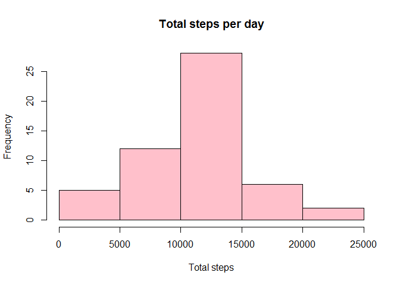
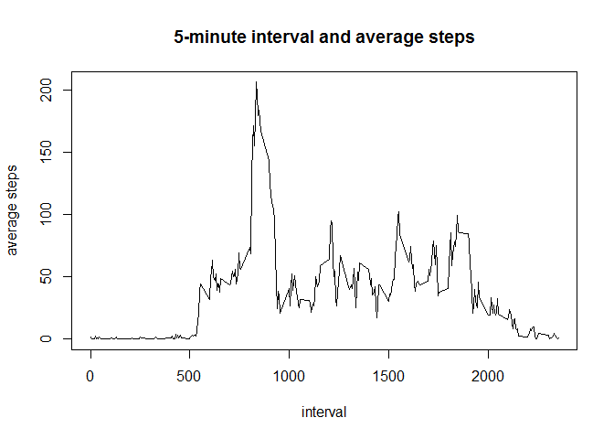
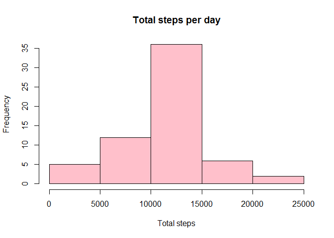
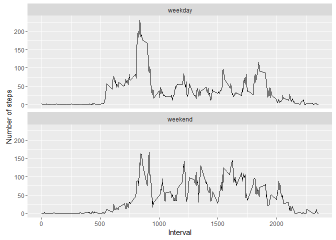

Load the data to activity, convert the date to act.
===================================================

    activity <- read.csv('activity.csv')
    activity1 <- activity[complete.cases(activity),]
    act <- activity1
    act$date <- as.POSIXct(strptime(activity1$date, '%Y-%m-%d'))

Load some packages like dplyr, ggplot2 and psych.
-------------------------------------------------

    library(dplyr)

    ## 
    ## Attaching package: 'dplyr'

    ## The following objects are masked from 'package:stats':
    ## 
    ##     filter, lag

    ## The following objects are masked from 'package:base':
    ## 
    ##     intersect, setdiff, setequal, union

    library(ggplot2)
    library(psych)

    ## 
    ## Attaching package: 'psych'

    ## The following objects are masked from 'package:ggplot2':
    ## 
    ##     %+%, alpha

What is mean total number of steps taken per day?
=================================================

1.  Calculate total number of steps taken per day.

<!-- -->

    (totalsteps <- summarise(group_by(activity1, date), sum(steps), mean(steps)))

    ## # A tibble: 53 × 3
    ##          date `sum(steps)` `mean(steps)`
    ##        <fctr>        <int>         <dbl>
    ## 1  2012-10-02          126       0.43750
    ## 2  2012-10-03        11352      39.41667
    ## 3  2012-10-04        12116      42.06944
    ## 4  2012-10-05        13294      46.15972
    ## 5  2012-10-06        15420      53.54167
    ## 6  2012-10-07        11015      38.24653
    ## 7  2012-10-09        12811      44.48264
    ## 8  2012-10-10         9900      34.37500
    ## 9  2012-10-11        10304      35.77778
    ## 10 2012-10-12        17382      60.35417
    ## # ... with 43 more rows

1.  Make a histogram of the total number of steps taken each day

<!-- -->

    hist(totalsteps$`sum(steps)`, main = 'Total steps per day', xlab = 'Total steps', col = 'pink')

1.  Calculate and report the mean and median of the total number of
    steps taken per day

<!-- -->

    (meanstep <- mean(totalsteps$`sum(steps)`))

    ## [1] 10766.19

    (medianstep <- median(totalsteps$`sum(steps)`))

    ## [1] 10765

What is the average daily activity pattern?
===========================================

1.  Make a time series plot of the 5-minute interval (x-axis) and the
    average number of steps taken, averaged across all days (y-axis)

<!-- -->

    timeseries <- summarise(group_by(activity1, interval), mean(steps))

    plot(timeseries$interval, timeseries$`mean(steps)`, type = 'l', 
         main = '5-minute interval and average steps', xlab = 'interval', ylab = 'average steps')

1.  Which 5-minute interval, on average across all the days in the
    dataset, contains the maximum number of steps?

<!-- -->

    act[which.max(act$steps),]

    ##       steps       date interval
    ## 16492   806 2012-11-27      615

Imputing missing values
=======================

1.  Calculate and report the total number of missing values in the
    dataset

<!-- -->

    summary(is.na(activity))

    ##    steps            date          interval      
    ##  Mode :logical   Mode :logical   Mode :logical  
    ##  FALSE:15264     FALSE:17568     FALSE:17568    
    ##  TRUE :2304      NA's :0         NA's :0        
    ##  NA's :0

    summary(activity)

    ##      steps                date          interval     
    ##  Min.   :  0.00   2012-10-01:  288   Min.   :   0.0  
    ##  1st Qu.:  0.00   2012-10-02:  288   1st Qu.: 588.8  
    ##  Median :  0.00   2012-10-03:  288   Median :1177.5  
    ##  Mean   : 37.38   2012-10-04:  288   Mean   :1177.5  
    ##  3rd Qu.: 12.00   2012-10-05:  288   3rd Qu.:1766.2  
    ##  Max.   :806.00   2012-10-06:  288   Max.   :2355.0  
    ##  NA's   :2304     (Other)   :15840

2.filling in all of the missing values with 'mean(steps)' and create new
dataset newact , repeat meansteps 61 times and fill in them to original
dataset$steps in which steps is NA

    newsteps <- (rep(summarise(group_by(activity1, interval), mean(steps))$'mean(steps)', times = 61))

    newact <- activity
    newact$steps[is.na(newact$steps)] <- newsteps[is.na(newact$steps)]

    (totalsteps2 <- summarise(group_by(newact, date), sum(steps), mean(steps)))

    ## # A tibble: 61 × 3
    ##          date `sum(steps)` `mean(steps)`
    ##        <fctr>        <dbl>         <dbl>
    ## 1  2012-10-01     10766.19      37.38260
    ## 2  2012-10-02       126.00       0.43750
    ## 3  2012-10-03     11352.00      39.41667
    ## 4  2012-10-04     12116.00      42.06944
    ## 5  2012-10-05     13294.00      46.15972
    ## 6  2012-10-06     15420.00      53.54167
    ## 7  2012-10-07     11015.00      38.24653
    ## 8  2012-10-08     10766.19      37.38260
    ## 9  2012-10-09     12811.00      44.48264
    ## 10 2012-10-10      9900.00      34.37500
    ## # ... with 51 more rows

1.  Make a histogram of the total number of steps taken each day and
    Calculate and report the mean and median total number of steps taken
    per day.

<!-- -->

    hist(totalsteps2$`sum(steps)`, main = 'Total steps per day', xlab = 'Total steps', col = 'pink')

    (meanstep <- mean(totalsteps2$`sum(steps)`))

    ## [1] 10766.19

    (medianstep <- median(totalsteps2$`sum(steps)`))

    ## [1] 10766.19

### Do these values differ from the estimates from the first part of the assignment? What is the impact of imputing missing data on the estimates of the total daily number of steps?

### mean and median are almost the same as the first part of the assignment, median increased by 1.

Are there differences in activity patterns between weekdays and weekends?
=========================================================================

1.  Create a new factor variable in the dataset with two levels –
    “weekday” and “weekend” indicating whether a given date is a weekday
    or weekend day.

<!-- -->

    newact$date <- as.POSIXct(strptime(newact$date, '%Y-%m-%d'))

    newact$day <- weekdays(newact$date)

    newact$day_type <- c('weekday')

    for (i in 1:nrow(newact)){
        if (newact$day[i] == 'Saturday' || newact$day[i] == 'Sunday'){
            newact$day_type[i] <- 'weekend'
        }
    }

    newact$day_type <- as.factor(newact$day_type)

    interval_steps <- aggregate(steps~interval+day_type,newact,mean)

1.  Make a panel plot containing a time series plot (i.e. type = "l") of
    the 5-minute interval (x-axis) and the average number of steps
    taken, averaged across all weekday days or weekend days (y-axis).

<!-- -->

    qplot(interval, steps, data=interval_steps, geom=c("line"), xlab="Interval",
          ylab="Number of steps") + facet_wrap(~day_type, ncol=1)

